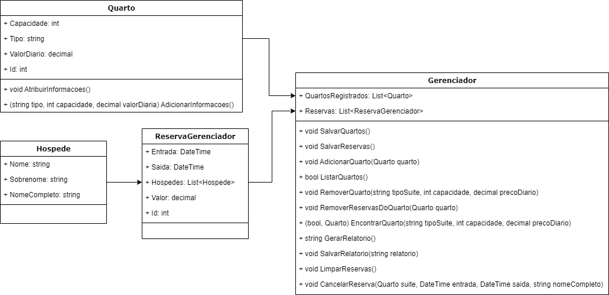

# Gerenciador do hotel
Este projeto deve ser utilizado para gerenciar o hotel, através dele pode-se adicionar e remover suítes, cancelar reservas e gerar um relatório com as principais informações do hotel, como os quartos existentes, reservas por quarto, valor total da reserva, lucro total do quarto e lucro total do hotel.

## Organização das classes
As classes desse projeto ficaram organizadas dessa forma:

## Explicação das classes

### Hospede
Essa classe representa um hóspede, ela possuí três propriedades, sendo eles: Nome, Sobrenome e NomeCompleto, todos são string.

### Quarto
Essa classe representa um quarto (suíte), ela possuí quatro propriedades, sendo elas: Capacidade (int), TipoSuite (string), ValorDiario (decimal) e Id (int).

A Capacidade é a quantidade máxima de hóspede que o quarto suporta.
O TipoSuite é sobre o tipo dela, como normal, premium, queen, etc...
O ValorDiario é o valor a ser cobrado por dia de permanência na suíte, seu tipo e capacidade influenciam esse valor.
O Id serve para correlacionar uma suíte com as reservas.

### ReservaGerenciador
Essa é uma classe de apoio, ela é utilizada na classe Reserva para obter as reservas já cadastradas pelo sistema, ou seja, descerializa-se o arquivo e passa essas informações para a classe Reserva.
Ela possuí quatro propriedades: Entrada (DateTime), Saida (DateTime), Hospedes (List<Pessoa>), Valor (decimal) e Id (int).
A Entrada é o dia de check-in do hotel.
A Saída é o dia de Check-out do hotel.
Hospedes representa uma lista com todos os hóspedes que ficarão na suíte.
Valor é o custo total da hospedagem.
O Id é utilizado para correlacionar a reserva com uma suíte.

### Gerenciador
Essa classe é a principal do projeto, ela interliga as outras e possuí os métodos que serão invocados no arquivo Program.cs.
Suas propriedades são: 
 - QuartosRegistrados (List<Quarto>): Lista de suítes cadastradas.
 - Reservas (List<ReservaGerenciador>): Lista de todas as reservas cadastradas.

Os métodos são:
 - SalvarQuartos(): Serializa a propriedade QuartosRegistrados e salva em um arquivo.
 - SalvarReservas(): Serializa a propriedades Reservas e salva em um arquivo.
 - AdicionarQuarto(Quarto quarto): Verifica e adiciona uma suíte na propriedade QuartosRegistrados.
 - ListarQuartos(): Lista todos os quartos cadastrados.
 - RemoverQuarto(string tipoSuite, int capacidade, decimal precoDiario): Caso o quarto seja encontrado, ele será removido da propriedade QuartosRegistrados.
 - RemoverReservasDoQuarto(Quarto quarto): Remove TODAS as reservas de um quarto.
 - EncontrarQuarto(string tipoSuite, int capacidade, decimal precoDiario): Confere se um quarto está registrado.
 - ListarReservas(Quarto quarto): Lista todas as reservas de um quarto;
 - GerarRelatorio(): Cria um relatório que contém informação sobre todos os quartos, reservas e lucros do hotel.
 - SalvarRelatorio(string relatorio): Salva o relatório.
 - LimparReservas(): Remove todas as reservas que já foram finalizadas, ou seja, que o dia de saída é menor que o dia atual.
 - CancelarReserva(Quarto suite, DateTime entrada, DateTime saida, string nomeCompleto): Cancela uma reserva, removendo ela da propriedade Reservas

## Vídeo
Por favor, para ver o sistema em funcionamento, acesse esse link: https://www.youtube.com/watch?v=HnPwitdQnNw