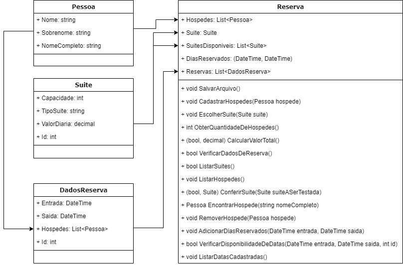

# Reserva do hotel
Este projeto deve ser utilizado para realizar reservas no hotel. Ele se comunica com o projeto GerenciadorHotel, recebendo dele as informações de suítes cadastradas e reservas realizadas. 
Com esse sistema pode-se adicionar, listar e remover hóspedes, selecionar as suítes e finalizar a reserva, exibindo o valor total da reserva e modificando o arquivo reservas.

## Organização das classes
As classes desse projeto ficaram organizadas dessa forma:

## Explicação das classes

### Pessoa
Essa classe representa um hóspede. Ela possuí três propriedades, sendo eles: Nome, Sobrenome e NomeCompleto, todos são string.

### Suite
Essa classe representa uma suíte. Ela possuí quatro propriedades, sendo elas: Capacidade (int), TipoSuite (string), ValorDiaria (decimal) e Id (int).

A Capacidade é a quantidade máxima de hóspede que a suíte suporta.
O TipoSuite é sobre o tipo dela, como normal, premium, queen, etc...
O ValorDiaria é o valor a ser cobrado por dia de permanência na suíte, seu tipo e capacidade influenciam esse valor.
O Id serve para correlacionar uma suíte com as reservas.

### DadosReserva
Essa é uma classe de apoio. Ela é utilizada na classe Reserva para obter as reservas já cadastradas pelo sistema, ou seja, descerializa-se o arquivo e passa essas informações para a classe Reserva.
Ela possuí quatro propriedades: Entrada (DateTime), Saida (DateTime), Hospedes (List<Pessoa>) e Id (int).
A Entrada é o dia de check-in do hotel.
A Saída é o dia de Check-out do hotel.
Hospedes representa uma lista com todos os hóspedes que ficarão na suíte.
O Id é utilizado para correlacionar a reserva com uma suíte.

### Reserva
Essa classe é a principal do projeto, ela interliga as outras e possuí os métodos que serão invocados no arquivo Program.cs.
Suas propriedades são: 
 - Hospedes (List<Pessoa>): Uma lista da classe Pessoa, nela temos todos os hóspedes que ficarão na suíte.
 - Suite (Suite): A suíte que será alugada.
 - SuitesDisponiveis (List<Suite>): Lista de todas as suítes disponíveis.
 - DiasReservados (DateTime entrada, DateTime saida): Dia de entrada e saída que se deseja reservar.
 - Reservas (List<DadosReserva>): Lista com todas as reservas já realizadas.

Os métodos são:
 - SalvarArquivo: Serializa a propriedade Reservas e as salva no arquivo "../GerenciadorHotel/Arquivos/reservas.json".
 - CadastrarHospedes(Pessoa hospede):  Se a quantidade de hóspedes for menor que a capacidade da suíte e o hóspede já não estiver cadastrado, ele será cadastrado.
 - EscolherSuite(Suite suite): Seleciona a suíte que se quer reservar.
 - ObterQuantidadeDeHospedes(): Retorna a quantidade de hóspedes cadastrados.
 - CalcularValorTotal(): Verifica se a reserva pode ser realizada. Caso sim, realiza a conta do custo total e salva a reserva através do método SalvarArquivo.
 - VerificarDadosDeReserva(): Retorna se todos os dados necessários para efetuar a reserva já foram passados e estão coerentes.
 - ListarSuites(): Lista todas as suítes disponíveis.
 - ConferirSuite(Suite suiteASerTestada): Confere se a suíte passada por argumento é válida.
 - ListarHospedes(): Lista todos os hóspedes cadastrados.
 - EncontrarHospede(): Pesquisa uma pessoa através do seu nome completo, retornando um objeto Pessoa.
 - RemoverHospede(Pessoa hospede): Através de um objeto do tipo Pessoa passado, remove ela da propriedade Hóspedes.
 - AdicionarDiasReservados(DateTime entrada, DateTime saida): Verifica a possibilidade dos dias desejados de entrada e saída. Se estiverem livres, seleciona essas datas.
 - VerificarDisponibilidadeDeDatas(DateTime entrada, DateTime saida, int id): Verifica se as datas de entrada e saída em uma determinada suíte (id) não são conflituosos com os já cadastrados.
 - ListarDatasCadastradas(): Lista todas as datas já cadastradas da suíte selecionada.

## Vídeo
Por favor, para ver o sistema em funcionamento, acesse esse link: https://www.youtube.com/watch?v=HnPwitdQnNw